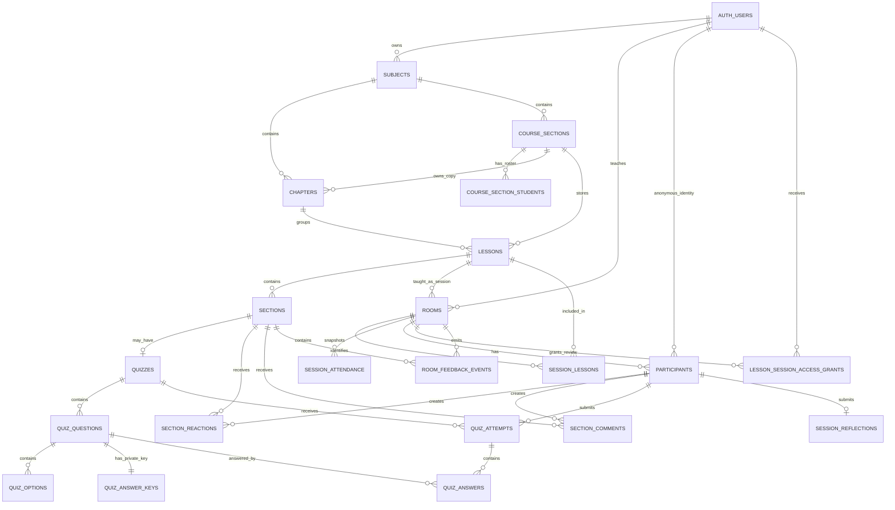

# MINCLASS — Database Documentation

## 1. Tổng quan

MINCLASS dùng Supabase PostgreSQL. Schema nghiệp vụ nằm trong `public`; các helper không được client gọi trực tiếp nằm trong schema `private`. Supabase Auth quản lý người dùng trong `auth.users`.

Migrations trong `supabase/migrations/` là source of truth. Không sửa migration đã áp dụng; mọi thay đổi schema phải tạo migration mới.

Hiện có 21 bảng nghiệp vụ trong schema `public`. Bảng `rooms` là tên kỹ thuật kế thừa từ MVP ban đầu và hiện đại diện cho **Chapter Session**; bảng `session_lessons` liên kết nhiều Lesson vào cùng buổi học. Ảnh Lesson được quản lý riêng trong `storage.objects` của Supabase Storage.

## 2. ERD

Quan hệ legacy `lessons.room_id` vẫn tồn tại để tương thích dữ liệu Room cũ nhưng persistent Lesson dùng `lessons.course_section_id`; Session mới liên kết ngược qua `rooms.lesson_id`.

## 3. Enum

| Enum | Giá trị | Ý nghĩa |
|---|---|---|
| `room_status` | `DRAFT`, `ACTIVE`, `ENDED` | Lifecycle Room cũ/Lesson Session; persistent Session mới dùng `ACTIVE` và `ENDED` |
| `section_type` | `CONTENT`, `QUIZ`, `REFLECTION` | Loại Section |
| `reaction_type` | `UNDERSTAND`, `UNSURE`, `QUESTION` | Reaction của Student |
| `quiz_question_type` | `SINGLE_CHOICE`, `MULTIPLE_CHOICE`, `TRUE_FALSE` | Loại câu hỏi Quiz |

## 4. Các bảng quản lý khóa học

### `subjects`

Môn học thuộc Teacher.

| Field | Kiểu | Vai trò |
|---|---|---|
| `id` | `uuid` | Primary key |
| `teacher_id` | `uuid` | FK → `auth.users.id`, Teacher sở hữu |
| `name` | `text` | Tên môn học, 1–120 ký tự |
| `code` | `text nullable` | Mã môn học chuẩn hóa chữ hoa |
| `created_at` | `timestamptz` | Thời điểm tạo |

Constraint/index quan trọng:

- Unique `(teacher_id, code)`; PostgreSQL cho phép nhiều Subject không có code.
- `subjects_teacher_created_idx (teacher_id, created_at desc)`.
- Teacher chỉ CRUD row có `teacher_id = auth.uid()` và đúng permanent Teacher account.

### `chapters`

Chapter trong Lesson Plan của Subject.

| Field | Kiểu | Vai trò |
|---|---|---|
| `id` | `uuid` | Primary key |
| `subject_id` | `uuid nullable` | FK → `subjects.id`, dùng cho Chapter mẫu |
| `course_section_id` | `uuid nullable` | FK → `course_sections.id`, dùng cho Chapter riêng của lớp |
| `template_chapter_id` | `uuid nullable` | FK tự tham chiếu đến Chapter mẫu, `ON DELETE SET NULL` |
| `name` | `text` | Tên Chapter, 1–120 ký tự |
| `preview_enabled` | `boolean` | Cho phép roster Student xem trước nội dung Chapter chưa có Session |
| `created_at` | `timestamptz` | Thời điểm tạo |
| `updated_at` | `timestamptz` | Tự cập nhật bằng trigger |

Constraint/index quan trọng:

- `num_nonnulls(subject_id, course_section_id) = 1`: Chapter thuộc đúng một Subject mẫu hoặc một Course Section.
- Unique case-insensitive theo Subject hoặc Course Section; index tên phục vụ sắp xếp tự nhiên.
- `(course_section_id, template_chapter_id)` là duy nhất khi còn liên kết đồng bộ.
- Trigger không cho chuyển Chapter sang parent khác và kiểm tra Chapter mẫu thuộc đúng Subject của lớp.
- `preview_enabled` cho phép Teacher mở Chapter chưa LIVE để Student thuộc roster xem trước ở chế độ chỉ đọc.

### `course_sections`

Lớp học phần thuộc Subject.

| Field | Kiểu | Vai trò |
|---|---|---|
| `id` | `uuid` | Primary key |
| `subject_id` | `uuid` | FK → `subjects.id`, `ON DELETE RESTRICT` ở schema hiện tại |
| `section_code` | `text` | Mã lớp học phần chuẩn hóa chữ hoa |
| `display_name` | `text nullable` | Tên hiển thị, tối đa 120 ký tự |
| `created_at` | `timestamptz` | Thời điểm tạo |

Constraint/index quan trọng:

- Unique `(subject_id, section_code)`.
- `course_sections_subject_created_idx (subject_id, created_at)`.
- Xóa Subject dùng RPC `delete_subject` để xóa cây dữ liệu theo đúng thứ tự thay vì dựa hoàn toàn vào cascade.

### `course_section_students`

Roster hiện tại của Course Section.

| Field | Kiểu | Vai trò |
|---|---|---|
| `id` | `uuid` | Primary key |
| `course_section_id` | `uuid` | FK → `course_sections.id`, cascade |
| `mssv` | `text` | MSSV đã chuẩn hóa |
| `normalized_mssv` | `text generated` | `upper(btrim(mssv))` |
| `created_at` | `timestamptz` | Thời điểm thêm |

Constraint/index quan trọng:

- MSSV phải khớp `^[A-Z0-9][A-Z0-9._-]{2,31}$`.
- Unique `(course_section_id, normalized_mssv)`.
- Index `(course_section_id, created_at)`.
- Student không có quyền tải toàn bộ bảng roster.

## 5. Lesson và Section

### `lessons`

Persistent Lesson hoặc Lesson của legacy Room.

| Field | Kiểu | Vai trò |
|---|---|---|
| `id` | `uuid` | Primary key |
| `room_id` | `uuid nullable` | Legacy FK → `rooms.id`, unique |
| `course_section_id` | `uuid nullable` | Persistent FK → `course_sections.id`, `ON DELETE RESTRICT` |
| `subject_id` | `uuid nullable` | FK → `subjects.id`, parent của Lesson mẫu |
| `chapter_id` | `uuid nullable` | FK → `chapters.id`, `ON DELETE RESTRICT` |
| `template_lesson_id` | `uuid nullable` | FK tự tham chiếu đến Lesson mẫu, `ON DELETE SET NULL` |
| `title` | `text` | Tên Lesson, 1–200 ký tự |
| `description` | `text nullable` | Mô tả, tối đa 1.000 ký tự |
| `markdown_source` | `text` | File Markdown nguyên bản |
| `metadata` | `jsonb` | Metadata bổ sung dạng object |
| `created_at` | `timestamptz` | Thời điểm tạo |
| `updated_at` | `timestamptz` | Tự cập nhật bằng trigger |

Constraint/index quan trọng:

- `num_nonnulls(room_id, course_section_id, subject_id) = 1`: Lesson chỉ có một loại parent legacy, Course Section hoặc Subject template.
- Persistent Lesson phải có Chapter thuộc đúng cùng Subject/Course Section; constraint trigger kiểm tra khi transaction kết thúc.
- `(course_section_id, template_lesson_id)` là duy nhất khi Lesson của lớp còn theo bản mẫu. Lesson đã tùy chỉnh riêng hoặc mất nguồn mẫu có thể để liên kết này `NULL`.
- Partial indexes theo Subject/Course Section và Chapter phục vụ danh sách Lesson đã sắp xếp.

### `sections`

Các phần tuần tự của Lesson.

| Field | Kiểu | Vai trò |
|---|---|---|
| `id` | `uuid` | Primary key |
| `lesson_id` | `uuid` | FK → `lessons.id`, cascade |
| `position` | `integer` | Vị trí bắt đầu từ 0 |
| `type` | `section_type` | `CONTENT`, `QUIZ` hoặc `REFLECTION` |
| `title` | `text` | Tiêu đề, 1–200 ký tự |
| `content_md` | `text` | Markdown của Section; Quiz dùng chuỗi rỗng |
| `created_at` | `timestamptz` | Thời điểm tạo |

Constraint/index quan trọng:

- Unique `(lesson_id, position)`.
- `position >= 0`.
- Index `sections_lesson_id_idx`.

## 6. Lesson Session và attendance

### `rooms`

Chapter Session runtime. Tên bảng được giữ để tái sử dụng live Room core.

| Field | Kiểu | Vai trò |
|---|---|---|
| `id` | `uuid` | Primary key/Session ID |
| `code` | `text nullable` | Legacy Room Code; Session mới không sử dụng |
| `teacher_user_id` | `uuid` | FK → `auth.users.id` |
| `lesson_id` | `uuid nullable` | FK → persistent `lessons.id`, `ON DELETE RESTRICT` |
| `course_section_id` | `uuid nullable` | FK → Course Section của Chapter Session |
| `chapter_id` | `uuid nullable` | FK → Chapter đang được dạy |
| `title` | `text` | Snapshot tên Session/Lesson |
| `status` | `room_status` | Lifecycle |
| `teaching_section` | `integer` | Position đang trình bày |
| `released_through` | `integer` | Position cuối Student được đọc |
| `created_at` | `timestamptz` | Thời điểm tạo |
| `started_at` | `timestamptz nullable` | Thời điểm Start |
| `ended_at` | `timestamptz nullable` | Thời điểm End |

Constraint/index/trigger quan trọng:

- Lifecycle timestamp phải phù hợp status.
- `released_through <= teaching_section`.
- Partial unique index chỉ cho một Chapter Session `ACTIVE` trong mỗi Course Section; các Course Section khác vẫn có thể LIVE đồng thời.
- `rooms.lesson_id`, `teaching_section` và `released_through` được giữ để tương thích Session một Lesson cũ; flow hiện tại lưu tiến độ từng Lesson ở `session_lessons`.
- `rooms_lesson_status_idx (lesson_id, status, ended_at desc)`.
- `rooms_teacher_user_id_idx`.
- `code` nullable sau khi Room Code bị loại khỏi persistent flow.

### `session_lessons`

Liên kết toàn bộ Lesson của Chapter với một Session và lưu tiến độ release độc lập cho từng Lesson.

| Field | Kiểu | Vai trò |
|---|---|---|
| `session_id` | `uuid` | PK/FK → `rooms.id`, cascade |
| `lesson_id` | `uuid` | PK/FK → `lessons.id`, cascade |
| `teaching_section` | `integer` | Section Teacher đang trình bày trong Lesson |
| `released_through` | `integer` | Section cuối Student được đọc, bắt đầu từ `-1` |
| `created_at` | `timestamptz` | Thời điểm đưa Lesson vào Session |

Primary key `(session_id, lesson_id)` ngăn trùng Lesson trong cùng Session. Constraint bảo đảm `released_through <= teaching_section`; RLS chỉ cho Teacher, Participant hoặc anonymous user có access grant phù hợp đọc quan hệ này.

### `session_attendance`

Roster snapshot bất biến theo Session.

| Field | Kiểu | Vai trò |
|---|---|---|
| `session_id` | `uuid` | PK/FK → `rooms.id`, cascade |
| `mssv` | `text` | PK, MSSV snapshot |
| `joined_at` | `timestamptz nullable` | `NULL` nếu chưa tham gia |

Constraint/index quan trọng:

- Composite primary key `(session_id, mssv)`.
- MSSV được validate và chuẩn hóa.
- Index `(session_id, joined_at)` phục vụ joined/absent count.
- Chỉ Teacher sở hữu Session có quyền đọc trực tiếp.

### `participants`

Student thực tế đã join Session.

| Field | Kiểu | Vai trò |
|---|---|---|
| `id` | `uuid` | Primary key |
| `room_id` | `uuid` | FK → `rooms.id`, cascade |
| `user_id` | `uuid` | FK → anonymous `auth.users.id`, cascade |
| `mssv` | `text` | MSSV đã join |
| `joined_at` | `timestamptz` | Thời điểm join |
| `last_seen_at` | `timestamptz` | Lần ghi nhận gần nhất |

Constraint/index quan trọng:

- Unique `(room_id, mssv)` giữ một Participant canonical cho mỗi Student trong Session.
- Một MSSV có thể tham gia từ nhiều anonymous browser; các phiên bổ sung được ánh xạ qua `lesson_session_access_grants` thay vì tạo Participant trùng.
- Index `participants_user_id_idx`.
- Join RPC chỉ insert Participant nếu MSSV có trong attendance snapshot.

### `lesson_session_access_grants`

Quyền tạm theo anonymous user để xem một Ended Session sau khi xác minh MSSV.

| Field | Kiểu | Vai trò |
|---|---|---|
| `id` | `uuid` | Primary key |
| `room_id` | `uuid` | FK → `rooms.id`, cascade |
| `user_id` | `uuid` | FK → `auth.users.id`, cascade |
| `mssv` | `text` | MSSV đã xác minh |
| `created_at` | `timestamptz` | Thời điểm cấp quyền |

Constraint/index quan trọng:

- Unique `(room_id, user_id)`.
- Index `(user_id, room_id)`.
- Student chỉ đọc grant của chính `auth.uid()`.
- RPC có thể cập nhật MSSV của grant sau khi xác minh lại attendance snapshot.

## 7. Reaction, comment và Realtime event

### `section_reactions`

| Field | Kiểu | Vai trò |
|---|---|---|
| `id` | `uuid` | Primary key |
| `section_id` | `uuid` | FK → `sections.id`, cascade |
| `participant_id` | `uuid` | FK → `participants.id`, cascade |
| `reaction` | `reaction_type` | Reaction hiện tại |
| `created_at`, `updated_at` | `timestamptz` | Audit timestamps |

- Unique `(section_id, participant_id)` bảo đảm một reaction/Student/Section.
- Trigger kiểm tra Section và Participant thuộc cùng Session/Lesson.
- Index theo `section_id` và `participant_id`.

### `section_comments`

| Field | Kiểu | Vai trò |
|---|---|---|
| `id` | `uuid` | Primary key |
| `section_id` | `uuid` | FK → `sections.id`, cascade |
| `participant_id` | `uuid` | FK → `participants.id`, cascade |
| `body` | `text` | Nội dung 1–500 ký tự |
| `is_anonymous` | `boolean` | Quyết định masking MSSV |
| `created_at` | `timestamptz` | Thời điểm gửi |

- Index `(section_id, created_at desc)` phục vụ comment mới nhất.
- Index theo `participant_id`.
- RPC chỉ cho comment Section đã released trong Session `ACTIVE`.
- Teacher snapshot tính `authorLabel` ở database: `Anonymous` hoặc MSSV.

### `room_feedback_events`

Event stream nhẹ để báo Dashboard fetch lại dữ liệu.

| Field | Kiểu | Vai trò |
|---|---|---|
| `id` | `bigint identity` | Primary key tăng dần |
| `room_id` | `uuid` | FK → `rooms.id`, cascade |
| `section_id` | `uuid` | FK → `sections.id`, cascade |
| `kind` | `text` | `REACTION`, `COMMENT` hoặc `QUIZ` |
| `created_at` | `timestamptz` | Thời điểm phát event |

- Index `(room_id, id desc)`.
- Trigger từ reaction/comment/quiz attempt tự insert event.
- Chỉ Teacher của Session đọc event; bảng nằm trong Supabase Realtime publication.

## 8. Quiz

### `quizzes`

Một Quiz trên một Section.

- `id` UUID primary key.
- `section_id` FK unique → `sections.id`, cascade.
- `title` 1–200 ký tự.
- `created_at`.
- Index theo `section_id`.

### `quiz_questions`

- `id` UUID primary key.
- `quiz_id` FK → `quizzes.id`, cascade.
- `position` integer không âm.
- `type` là `quiz_question_type`.
- `question_text` dài 1–1.000 ký tự.
- Unique `(quiz_id, position)` và index theo `quiz_id`.

### `quiz_options`

- `id` UUID primary key.
- `question_id` FK → `quiz_questions.id`, cascade.
- `position` integer không âm.
- `content` dài 1–500 ký tự.
- Unique `(question_id, position)` và index theo `question_id`.

### `quiz_answer_keys`

- `question_id` vừa là primary key vừa là FK → `quiz_questions.id`, cascade.
- `correct_option_ids` là mảng UUID không rỗng.
- Trigger kiểm tra option thuộc đúng question và số đáp án đúng phù hợp question type.
- Student không có direct read access; RPC chấm điểm và Ended Review kiểm soát việc expose.

### `quiz_attempts`

- `id` UUID primary key.
- `quiz_id` FK → `quizzes.id`, cascade.
- `participant_id` FK → `participants.id`, cascade.
- `score`, `total_questions`.
- `submitted_at`.
- Unique `(quiz_id, participant_id)` ngăn double submit.
- Check `0 <= score <= total_questions` và `total_questions > 0`.
- Index theo `participant_id`.

### `quiz_answers`

- `id` UUID primary key.
- `attempt_id` FK → `quiz_attempts.id`, cascade.
- `question_id` FK → `quiz_questions.id`, cascade.
- `selected_option_ids` UUID array không rỗng.
- `is_correct` do server/database tính.
- Unique `(attempt_id, question_id)`.
- Index theo `question_id`.

## 9. Session Reflection

### `session_reflections`

Tổng kết cá nhân gửi sau Session.

| Field | Kiểu | Vai trò |
|---|---|---|
| `id` | `uuid` | Primary key |
| `participant_id` | `uuid` | Unique FK → `participants.id`, cascade |
| `speaking_count` | `integer` | Số lần phát biểu, 0–999 |
| `review_body` | `text nullable` | Review đã trim, tối đa 1.000 ký tự |
| `created_at`, `updated_at` | `timestamptz` | Audit timestamps |

Quy tắc:

- Unique `participant_id` bảo đảm một reflection/Student/Session.
- RPC cuối cùng dùng insert-only và trả duplicate error, không cho sửa sau submit.
- Chỉ Participant sở hữu hoặc Teacher của Session được đọc.
- Bảng nằm trong Realtime publication để Teacher nhận review mới.

## 10. RLS và quyền truy cập

Tất cả bảng nghiệp vụ nhạy cảm bật RLS. Mô hình quyền chính:

| Nhóm dữ liệu | Teacher | Student |
|---|---|---|
| Subject/Chapter/Course Section | Chỉ dữ liệu thuộc mình | Không đọc trực tiếp; catalog qua RPC giới hạn field |
| Roster | Owner CRUD | Không được download/read toàn bộ |
| Lesson/Section | Owner quản lý | Chỉ snapshot được RPC cho phép |
| Session | Owner quản lý | Participant hoặc access grant phù hợp |
| Attendance | Owner đọc | Không đọc trực tiếp |
| Reaction | Owner xem aggregate | Chỉ reaction của chính mình khi LIVE |
| Comment | Owner xem qua masked snapshot | Tạo comment của chính mình khi LIVE |
| Answer key | Owner qua flow quản trị | Không direct read; chỉ post-submit/ENDED RPC |
| Quiz attempt/answer | Owner xem analytics | Chỉ dữ liệu của chính Participant |
| Session reflection | Owner xem | Chỉ reflection của chính mình |

Security-definer RPC luôn phải tự kiểm tra `auth.uid()`, claim anonymous/permanent, ownership, Session status và quan hệ dữ liệu. `SET search_path = ''` giảm nguy cơ object shadowing.

## 11. RPC quan trọng

| RPC | Mục đích |
|---|---|
| `replace_course_section_roster` | Replace roster atomically sau validation |
| `create_course_section_lesson` | Tạo Lesson, Section, Quiz và answer key |
| `create_course_section_lessons_batch` / `create_subject_template_lessons_batch` | Tạo tối đa 20 Lesson trong một transaction |
| `create_*_synced` / `update_*_synced` / `delete_*_synced` | Thay đổi Lesson Plan và tùy chọn đồng bộ sang Course Section cũ |
| `start_chapter_session` | Tạo ACTIVE Chapter Session, `session_lessons` và attendance snapshot |
| `join_live_chapter_session` | Join Chapter Session bằng Session ID + MSSV; hỗ trợ nhiều browser cho cùng MSSV |
| `release_session_lesson_section` | Release Section tuần tự riêng của một Lesson |
| `release_entire_chapter` | Release toàn bộ Section còn lại trong Chapter Session |
| `set_section_reaction` | Create/update reaction của Participant |
| `create_section_comment` | Tạo comment và enforce identity/status |
| `get_session_student_quiz_snapshot` | Trả Quiz an toàn cho Student |
| `submit_session_quiz` | Chấm và lưu Quiz trên server |
| `end_room` | Chuyển Session sang ENDED |
| `access_ended_lesson_session` | Xác minh MSSV và cấp review access grant |
| `get_student_ended_lesson_review` | Trả Lesson/answer key sau ENDED |
| `save_own_session_reflection` | Gửi reflection một lần |
| `get_teacher_room_summary_overview` | Aggregate Summary nhẹ để render đầu trang |
| `get_teacher_room_attendance_detail` | Lazy-load chi tiết attendance |
| `get_teacher_room_summary_lessons` / `get_teacher_room_lesson_summary` | Danh sách và Summary theo từng Lesson |
| `get_teacher_lesson_feedback_snapshot` | Feedback riêng theo Lesson đang chọn |
| `get_teacher_lesson_quiz_analytics` | Quiz analytics riêng theo Lesson |
| `get_teacher_class_voices` | Masked Class Voices data |
| `get_teacher_session_reflections` | Session Reviews cho Teacher |
| `get_teacher_course_section_export` | Aggregate dữ liệu Excel |
| `get_public_subject_course_sections` / `get_public_course_section_catalog` / `get_public_chapter_catalog` | Public catalog gộp, giảm số query nối tiếp |
| `verify_course_section_student` / `get_student_chapter_preview` | Xác minh một MSSV trong roster và trả nội dung Chapter xem trước an toàn |
| `delete_room` | Xóa Session và dữ liệu con |
| `delete_subject` | Xóa cây Subject theo thứ tự an toàn |

Các RPC Room Code cũ vẫn có thể tồn tại trong lịch sử migration nhưng đã bị revoke ở migration hiện hành và không thuộc public application flow.

## 12. Index quan trọng

| Index/constraint | Tác dụng |
|---|---|
| `rooms_one_active_chapter_session_per_course_idx` | Ngăn hai Chapter Session ACTIVE trong cùng Course Section |
| `rooms_lesson_status_idx` | Tìm LIVE/latest ENDED Session theo Lesson |
| `rooms_course_section_chapter_started_idx` | Tìm lịch sử Session theo lớp, Chapter và thời điểm bắt đầu |
| `session_lessons_lesson_session_idx` | Tìm các Session chứa một Lesson |
| `subjects_teacher_created_idx` | Danh sách Subject theo Teacher |
| `course_sections_subject_created_idx` | Danh sách Course Section theo Subject |
| `chapters_subject_name_unique_idx` | Tên Chapter không trùng, không phân biệt hoa thường |
| `course_section_students_mssv_unique` | MSSV không trùng trong Course Section |
| `session_attendance` primary key | Một MSSV một dòng snapshot trong Session |
| `participants (room_id, mssv)` | Giữ một Participant canonical cho mỗi MSSV trong Session |
| `sections (lesson_id, position)` | Thứ tự Section duy nhất |
| `section_reactions (section_id, participant_id)` | Một reaction/Student/Section |
| `quiz_attempts (quiz_id, participant_id)` | Một attempt/Student/Quiz |
| `room_feedback_events_room_id_id_idx` | Realtime event mới nhất theo Session |
| `quiz_answers_question_attempt_cover_idx` | Covering index cho correct rate và answer distribution |

## 13. Cascade và xóa dữ liệu

- Xóa Session (`rooms`) cascade `session_lessons`, attendance, participant, access grant và feedback event.
- Participant cascade reaction, comment, Quiz attempt/answer và session reflection.
- Section/Lesson cascade nội dung Quiz theo cây FK tương ứng.
- Một số parent FK đã chuyển sang `ON DELETE RESTRICT` để ngăn xóa ngoài ý muốn.
- `delete_subject` và `delete_room` thực hiện kiểm tra owner và xóa theo thứ tự có kiểm soát.
- Xóa Session không xóa persistent Lesson.

## 14. Realtime publication

Các bảng/event source hiện được đưa vào Supabase Realtime publication:

- `rooms` — Section flow và End Session.
- `participants` — Student join.
- `session_attendance` — joined count.
- `room_feedback_events` — reaction, comment và Quiz signal.
- `session_reflections` — review cuối buổi.

Realtime không thay thế query database. Client phải refetch snapshot sau event hoặc reconnect.

Supabase Storage bucket `lesson-images` là public để Markdown có thể hiển thị ảnh, giới hạn 5 MB và chỉ nhận `image/png`, `image/jpeg`, `image/webp`. Policy trên `storage.objects` chỉ cho permanent Teacher quản lý object theo đường dẫn `{teacher_id}/{subject_id}/...`; helper `private.can_manage_lesson_image` kiểm tra ownership mà không dùng service role.
