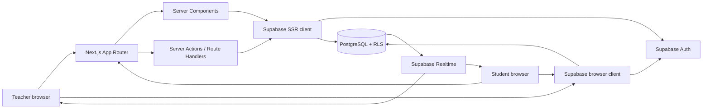
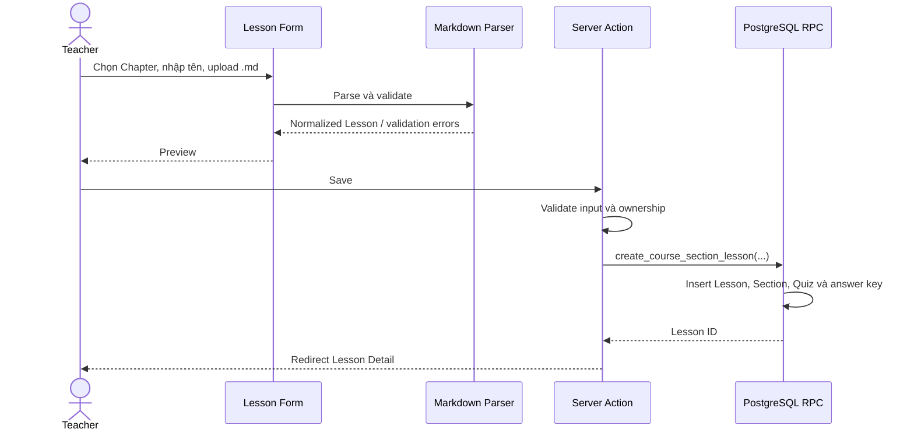
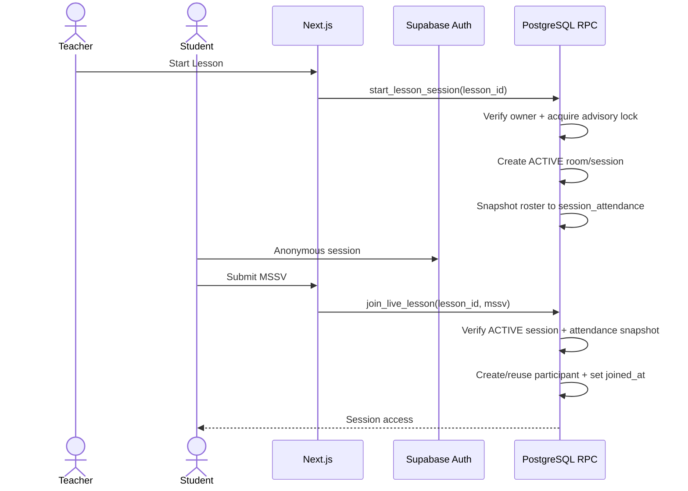
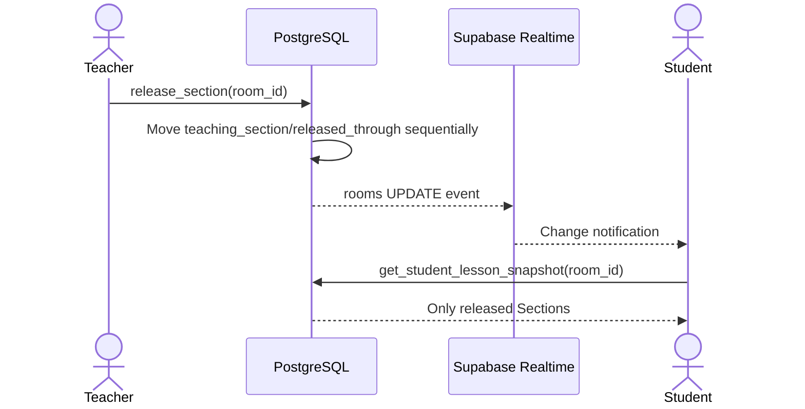
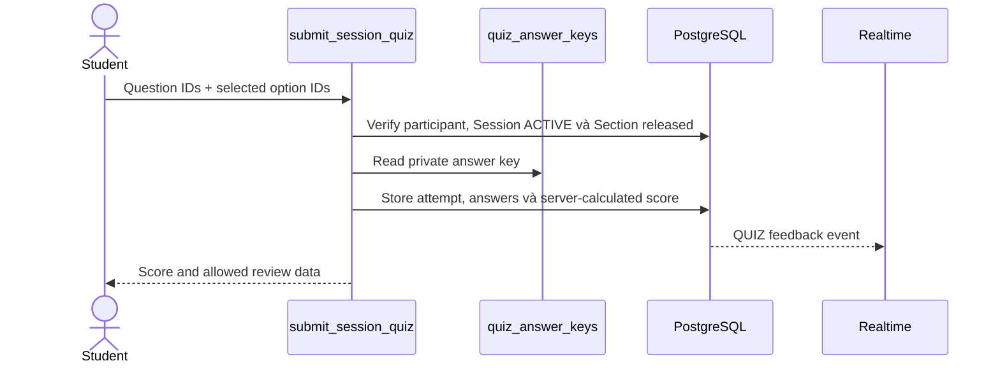

# MINCLASS — Technical Documentation

## 1. System architecture

MINCLASS là một Next.js App Router application kết nối trực tiếp với Supabase. Project không có backend framework riêng; server-side orchestration nằm trong Server Components, Server Actions, Route Handlers và PostgreSQL RPC.



Nguyên tắc trạng thái:

- PostgreSQL là source of truth.
- Realtime event chỉ yêu cầu client đồng bộ lại dữ liệu.
- React state là cache và trạng thái tương tác tạm thời.
- Sau reconnect, client fetch lại snapshot từ database.

## 2. Frontend architecture

### App Router

Server Components được dùng mặc định để load dữ liệu và kiểm tra quyền trước khi render. Client Components chỉ dùng cho form tương tác, browser API, optimistic UI, carousel và Realtime subscriptions.

Các route chính:

| Route | Vai trò | Chức năng |
|---|---|---|
| `/` | Public | Landing page |
| `/teacher/login` | Teacher | Đăng nhập |
| `/teacher/subjects` | Teacher | Danh sách Subject |
| `/teacher/subjects/[subjectId]` | Teacher | Subject Detail, Chapter và Course Section |
| `/teacher/subjects/[subjectId]/sections/[courseSectionId]` | Teacher | Roster, Lesson theo Chapter và export |
| `.../lessons/new` | Teacher | Tạo Lesson từ Markdown |
| `.../lessons/[lessonId]` | Teacher | Lesson Detail và Session History |
| `/teacher/rooms/[roomId]` | Teacher | Live Dashboard |
| `/teacher/rooms/[roomId]/summary` | Teacher | Session Summary/Lesson Review |
| `/teacher/rooms/[roomId]/reviews` | Teacher | Session Reviews |
| `/teacher/rooms/[roomId]/voices` | Teacher | Class Voices |
| `/learn` | Student/Public | Danh sách Subject |
| `/learn/subjects/[subjectId]` | Student/Public | Danh sách Course Section |
| `/learn/subjects/[subjectId]/sections/[courseSectionId]` | Student/Public | Lesson theo Chapter |
| `/learn/lessons/[lessonId]` | Student | MSSV access gate |
| `/student/rooms/[roomId]` | Student | Lesson Session LIVE/ENDED |
| `/learn/review/[sessionId]` | Student | Ended Lesson Review |
| `.../export` | Teacher | Download Excel |

Tên route `/rooms/` được giữ để tái sử dụng live core; về nghiệp vụ, `roomId` hiện đại diện cho Lesson Session.

### Component boundaries

- Page/Server Component gọi feature query để lấy snapshot ban đầu.
- Feature component nhận typed data và xử lý trình bày.
- Form tương tác gọi Server Action hoặc browser-side RPC wrapper.
- Business validation không đặt trực tiếp trong JSX.
- Markdown được parse thành normalized domain data trước khi render.

## 3. Backend architecture

Backend của MINCLASS gồm hai lớp:

### Next.js server layer

- Server Components load dữ liệu theo route.
- Server Actions validate `FormData`, gọi Supabase và revalidate/redirect.
- Route Handler tạo file Excel ở server.
- Supabase SSR client chuyển tiếp Auth cookie từ request.
- Proxy refresh Supabase session bằng `getClaims()`.

### Supabase database layer

- PostgreSQL lưu trạng thái thật.
- RLS bảo vệ direct table access.
- Database constraints bảo vệ invariant và duplicate.
- Security-definer RPC xử lý các transaction nhạy cảm.
- Triggers phát Realtime event hoặc bảo vệ quan hệ.
- Advisory lock ngăn race condition khi Start Session và thay roster.

Project không dùng service-role key trong runtime và không có NestJS/Express API riêng.

## 4. Các module chính

| Module | Vị trí | Trách nhiệm |
|---|---|---|
| Auth | `src/features/auth/` | Teacher login/logout, server-side identity guard |
| Subjects | `src/features/subjects/` | Subject, Course Section, Chapter, roster và Excel export |
| Lessons | `src/features/lessons/` | Markdown parser, Lesson creation, preview và Session start |
| Catalog | `src/features/catalog/` | Public catalog, MSSV gate và Ended Lesson Review |
| Rooms | `src/features/rooms/` | Section flow, attendance, reaction, comment, Quiz, Summary và presentation |
| Supabase | `src/lib/supabase/` | Browser/server client, config và cookie refresh |
| Shared UI | `src/components/` | Back link, add action button và anonymous bootstrap |

### Auth module

- `teacher-session.ts`: xác minh permanent Teacher trên server.
- `actions.ts`: login/logout bằng Supabase Auth.
- `teacher-auth-form.tsx`: form đăng nhập.
- `teacher-account-menu.tsx`: đăng xuất.

### Subjects module

- CRUD Subject, Course Section và Chapter.
- Parse/preview/replace roster.
- Query Course Section Detail và Session metadata.
- Tạo workbook Excel từ dữ liệu aggregate của database.

### Lessons module

- `markdown/parser.ts`: parse frontmatter và `:::section`/`:::quiz` directives.
- `markdown/schema.ts`: normalized Lesson schema.
- `create-course-section-lesson-form.tsx`: upload, validate, preview và save.
- `session-actions.ts`: Start Lesson Session.
- Lesson Review Player hiển thị Section theo kiểu trái/phải.

### Rooms module

- `lesson-flow.ts`: parse Student Lesson snapshot.
- `feedback.ts`: reaction/comment domain schemas.
- `quiz.ts`: Quiz snapshot và analytics schemas.
- `summary.ts`: Summary data contract.
- `class-voices.ts`: Class Voices data contract.
- Realtime clients subscribe rồi gọi lại snapshot loader.

## 5. Luồng dữ liệu chính

### Tạo Lesson



### Start và join Lesson Session



### Section và Realtime



### Quiz submit



## 6. Authentication và authorization

### Teacher authentication

- UI nhận username `thaybao`.
- Server ánh xạ username đến email Supabase Auth `thaybao@minclass.local`.
- Password được Supabase Auth xác thực.
- `requireTeacher()` chặn server-side cho route Teacher.
- RLS/RPC đồng thời kiểm tra `auth.uid()`, anonymous claim và email Teacher.

Không chỉ dựa vào client redirect để bảo vệ route.

### Student identity

- `AnonymousAuthBootstrap` tạo Supabase anonymous session cho route không phải Teacher.
- `participants.user_id` gắn anonymous Auth user với một MSSV trong một Session.
- Unique constraints ngăn một MSSV hoặc một anonymous user join trùng trong Session.
- Student không có account UI.

### Authorization layers

```text
Input validation (Zod)
        ↓
Server route/action ownership check
        ↓
PostgreSQL RPC validation
        ↓
RLS + foreign key + unique/check constraints
```

Các nguyên tắc quan trọng:

- Teacher chỉ truy cập cây dữ liệu thuộc `teacher_id/auth.uid()`.
- Student LIVE phải thuộc attendance snapshot.
- Student Review phải có access grant được cấp sau MSSV verification.
- Unreleased Section không được trả về.
- Answer key không được cấp direct `SELECT` cho Student.
- Anonymous masking được tính ở server/database.
- Mutation sau `ENDED` bị RPC/database từ chối.

## 7. Realtime architecture

Realtime được dùng cho:

- Trạng thái Section và End Session từ `rooms`.
- Participant count từ `participants`/`session_attendance`.
- Reaction/comment/Quiz qua `room_feedback_events`.
- Session Review qua `session_reflections`.

Client subscription không tự coi payload là source of truth. Khi nhận event hoặc reconnect, client gọi query/RPC snapshot tương ứng. Một số component có fallback polling khi channel error, timeout hoặc closed.

## 8. Markdown architecture và XSS

Pipeline:

```text
Raw Markdown
  → Normalize newline/BOM
  → Parse YAML frontmatter/directives
  → Validate allowed Markdown AST nodes and URLs
  → Normalize Lesson domain data
  → Persist source + normalized relational records
  → Render with React Markdown without raw HTML
```

Chỉ hỗ trợ paragraph, heading, strong, emphasis, list, link, image, inline code, fenced code và line break. HTML tùy ý bị parser từ chối. Link/ảnh chỉ chấp nhận protocol được cho phép.

## 9. External services

### Supabase

Supabase là external service duy nhất của runtime:

- Auth: permanent Teacher và anonymous Student identity.
- PostgreSQL: domain data và transaction logic.
- RLS: row-level authorization.
- Realtime: change notification.

Ứng dụng không tích hợp email provider, payment, AI, object storage hay analytics service bên thứ ba.

## 10. Các quyết định kỹ thuật quan trọng

### Evolve `rooms` thành Lesson Session

Live Room core đã hoạt động ổn định nên bảng `rooms` được tái sử dụng làm Lesson Session thay vì tạo hệ thống song song. `rooms.lesson_id` liên kết Session với persistent Lesson; `code` được giữ nullable để tương thích migration cũ nhưng không còn dùng trong flow hiện tại.

### Persistent Lesson tách khỏi Session

Lesson content được lưu một lần trong Course Section. Mỗi lần Start chỉ tạo Session mới, không sao chép hoặc thay đổi nội dung Lesson.

### Attendance snapshot

Roster được chụp vào `session_attendance` khi Start. Update roster sau này không sửa lịch sử Session.

### Database RPC cho mutation nhạy cảm

Join, Start, release Section, submit Quiz, End, Summary và access Review được xử lý trong database để tránh client bypass và giảm race condition.

### Answer key riêng tư

`quiz_answer_keys` không được gửi trước submit. Server/RPC chấm điểm. Ended Review chỉ trả answer key sau khi xác minh Session và MSSV.

### Không dùng service role

Mọi runtime request dùng publishable key cộng Auth session và RLS. Service role không được đưa vào browser hoặc dùng để sửa lỗi quyền.

## 11. Testing

- Unit tests đặt cạnh feature dưới tên `*.test.ts`.
- Database/RLS tests nằm trong `supabase/tests/`.
- Markdown parser, roster parser, auth action, Session flow, feedback, Quiz, Summary, review và export đều có test tương ứng.

Các lệnh:

```bash
pnpm lint
pnpm typecheck
pnpm test
pnpm test:db
pnpm build
```

## 12. Deployment

- Next.js tạo standalone output ngoài Vercel.
- Dockerfile dùng multi-stage build và chạy bằng non-root user.
- Supabase URL/publishable key cần có ở build time và runtime.
- App server nên deploy gần region của Supabase để giảm latency từ các query nối tiếp.
- Production URL phải được thêm vào Supabase Auth site URL và redirect allow list.
