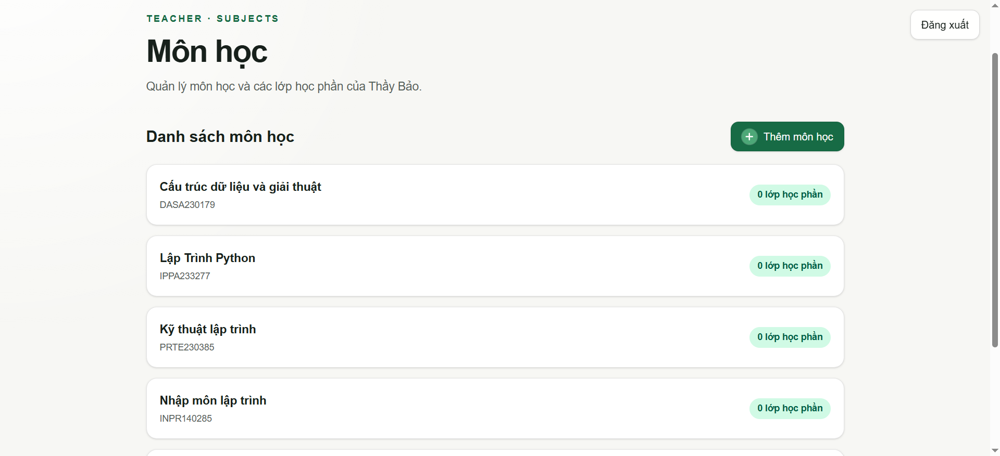
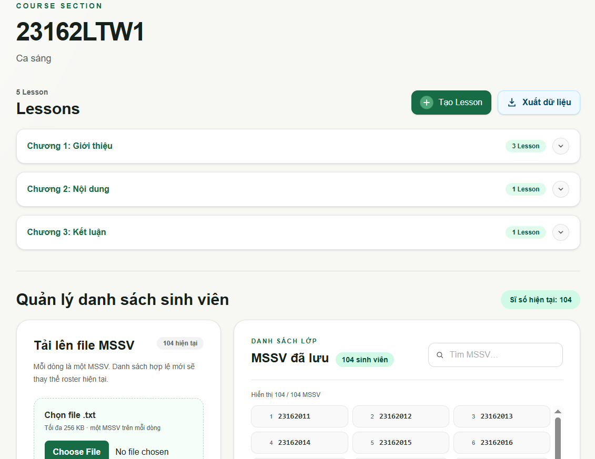
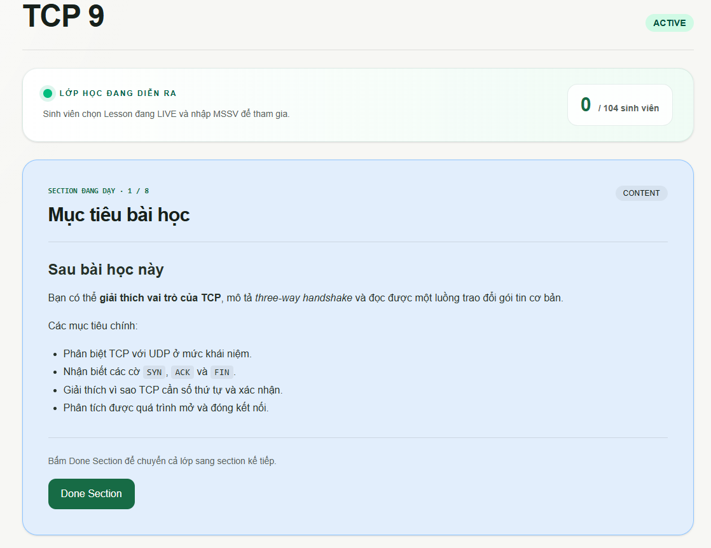
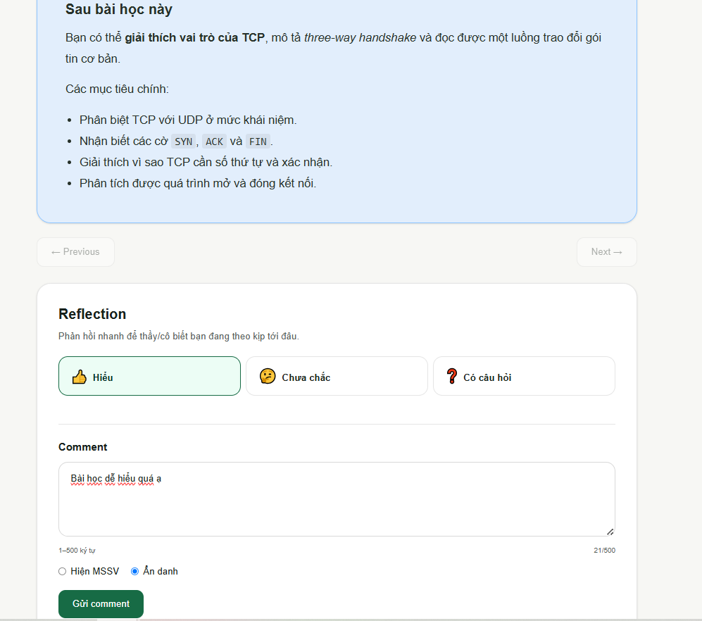
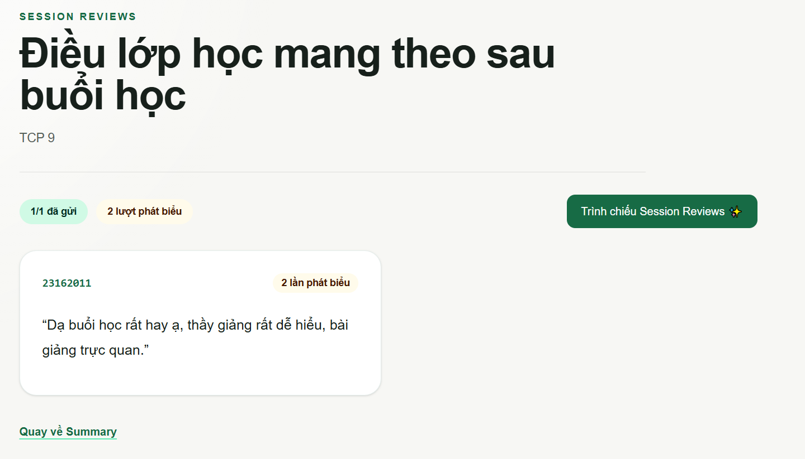
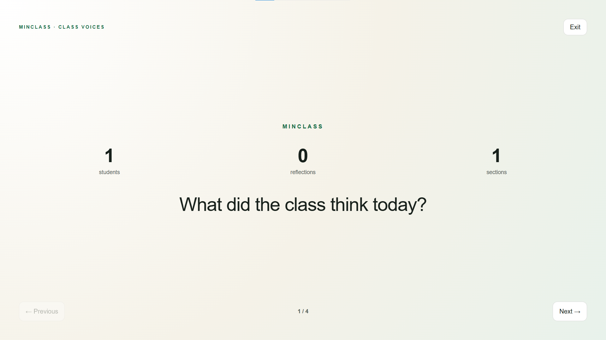

# MINCLASS — Hướng dẫn sử dụng


Tài liệu này dành cho người sử dụng MINCLASS. Sinh viên không cần tạo tài khoản và không cần Room Code.

## 1. Vai trò người dùng

### Giảng viên

Giảng viên chuẩn bị môn học, lớp học phần, roster và Lesson; bắt đầu buổi học, điều khiển Section và xem dữ liệu tổng kết.

### Sinh viên

Sinh viên browse bài học, nhập MSSV để tham gia Lesson LIVE hoặc xem lại Lesson đã kết thúc. Sinh viên không có email, mật khẩu hay tài khoản MINCLASS.

## 2. Đăng ký và đăng nhập

### Giảng viên

MINCLASS không có màn hình đăng ký. Tài khoản Teacher được người quản trị cấu hình trước trong Supabase.

1. Mở trang chủ MINCLASS.
2. Chọn **Đăng nhập** ở góc trên bên phải.
3. Nhập username `thaybao`.
4. Nhập mật khẩu Teacher do người quản trị cung cấp.
5. Chọn **Đăng nhập**.
6. Sau khi thành công, hệ thống chuyển đến `/teacher/subjects`.

Nếu đã đăng nhập, nút trên trang chủ hiển thị **Quản lý**. Tại trang quản trị, nút góc trên bên phải chỉ hiển thị **Đăng xuất**.

### Sinh viên

Sinh viên không đăng ký và không đăng nhập. MINCLASS tự tạo một anonymous session trong trình duyệt để bảo vệ dữ liệu của từng Student.

## 3. Hướng dẫn dành cho giảng viên

### 3.1. Tạo môn học

1. Mở trang **Danh sách môn học**.
2. Chọn **Thêm môn học**.
3. Nhập tên môn học và mã môn học nếu cần.
4. Lưu thông tin.

Mỗi thẻ môn học hiển thị tên, mã và số lớp học phần đã tạo. Có thể chỉnh sửa hoặc xóa môn học từ thẻ tương ứng.

### 3.2. Quản lý Lesson Plan

1. Mở chi tiết một môn học.
2. Chọn **Lesson Plan**.
3. Chọn **Thêm** để nhập tên Chapter, ví dụ `Chương 1: Giới thiệu`.
4. Chọn **Sửa** để cập nhật tên Chapter.

Các Chapter được sắp xếp theo tên và dùng chung cho các Course Section thuộc Subject.

### 3.3. Tạo lớp học phần

1. Trong trang môn học, chọn **Thêm lớp học phần**.
2. Nhập mã lớp học phần.
3. Nhập tên hiển thị nếu cần.
4. Lưu thông tin.

Chọn vào mã trên thẻ lớp học phần để mở trang Course Section. Tại đây có thể chỉnh sửa, xóa, quản lý sinh viên, tạo Lesson và xuất dữ liệu.

### 3.4. Upload danh sách sinh viên

Chuẩn bị file `.txt`, mỗi dòng chứa một MSSV:

```text
23162011
23162012
23162013
```

Thao tác:

1. Mở khu vực **Quản lý danh sách sinh viên**.
2. Chọn file `.txt`.
3. Kiểm tra preview: số MSSV hợp lệ, dòng trùng và dòng không hợp lệ.
4. Chỉ chọn lưu khi danh sách không còn lỗi.
5. Dùng ô tìm kiếm để kiểm tra MSSV sau khi lưu.

MSSV được trim và chuẩn hóa thành chữ hoa. Dòng rỗng được bỏ qua. File tối đa 256 KB và danh sách tối đa 2.000 MSSV.

Việc cập nhật roster không thay đổi attendance của những Session đã diễn ra.

### 3.5. Tạo Lesson

1. Tại Course Section, chọn **Tạo Lesson**.
2. Chọn Chapter chứa Lesson.
3. Nhập tên Lesson.
4. Upload file `.md`.
5. Kiểm tra phần preview.
6. Chọn lưu khi file hợp lệ.

Nút **Cách viết file lesson** mở hướng dẫn cú pháp ngay trên trang tạo Lesson. Lesson mới lưu ở trạng thái **Chưa live**.

### 3.6. Bắt đầu Lesson LIVE

1. Tại thẻ Lesson, chọn **Start Lesson**.
2. Hệ thống tạo Session LIVE và snapshot roster hiện tại.
3. Nút của Lesson đổi thành **Dashboard**.
4. Yêu cầu sinh viên mở Lesson và nhập MSSV.

Một Course Section chỉ có một Lesson LIVE tại một thời điểm. MINCLASS không sử dụng Room Code hoặc Session Code.

### 3.7. Điều khiển buổi học

Dashboard hiển thị:

- Sĩ số của roster snapshot.
- Số sinh viên đã tham gia.
- Section đang trình bày.
- Reaction và comment mới.
- Tiến độ và kết quả Quiz.

Khi hoàn thành nội dung hiện tại, chọn **Next Section** hoặc **Done Section**. Hệ thống mở Section kế tiếp cho sinh viên và cập nhật giao diện gần realtime.

Không thể skip Section và không có Undo trong flow hiện tại.

### 3.8. Kết thúc buổi học

1. Chọn **Kết thúc buổi học**.
2. Đọc nội dung xác nhận.
3. Xác nhận kết thúc.

Sau khi kết thúc:

- Student chỉ được đọc nội dung đã mở.
- Không thể gửi reaction, comment hoặc Quiz mới.
- Student có thể gửi tổng kết cá nhân một lần.
- Teacher được chuyển đến Summary.

### 3.9. Xem lịch sử và tổng kết

Mở Course Section → Lesson → **Xem lịch sử**. Mỗi Session hiển thị trạng thái và nút **Xem Lesson Review**.

Lesson Review gồm:

- Attendance snapshot, danh sách đã tham gia và danh sách vắng.
- Thống kê Quiz.
- Reaction theo Section.
- Comment có MSSV hoặc ẩn danh.
- Nội dung Lesson theo dạng chuyển Section trái/phải.

Trong **Tổng kết buổi học**:

- **Xem Reviews**: xem số lần phát biểu và lời review cuối buổi; có chế độ trình chiếu.
- **Xem phản hồi**: mở Class Voices từ comment trong Session; có chế độ trình chiếu.

### 3.10. Xuất dữ liệu Excel

Tại Course Section, chọn **Xuất dữ liệu**. File tải xuống gồm:

- MSSV trong roster hiện tại.
- Tổng số lần phát biểu.
- Số Lesson đã tham gia trên tổng số Lesson.

Một Lesson được tính là một buổi học. Nếu có nhiều Session cho cùng Lesson, Student tham gia nhiều Session vẫn chỉ được tính một buổi tham gia.

### 3.11. Xóa dữ liệu

Subject, Course Section và Lesson Session đều yêu cầu xác nhận trước khi xóa.

Khi xóa Session, attendance, participant, reaction, comment, Quiz result và review của Session bị xóa vĩnh viễn; Lesson gốc vẫn được giữ lại.

## 4. Hướng dẫn dành cho sinh viên

### 4.1. Tìm Lesson

1. Mở trang chủ.
2. Chọn **Khám phá bài học**.
3. Chọn Subject.
4. Chọn Course Section.
5. Mở Chapter để xem danh sách Lesson.

Lesson có ba trạng thái:

- **Chưa live**: chưa thể truy cập nội dung.
- **LIVE**: có thể tham gia bằng MSSV.
- **Đã kết thúc**: có thể xem lại bằng MSSV.

### 4.2. Tham gia Lesson LIVE

1. Chọn Lesson có trạng thái **LIVE**.
2. Nhập MSSV có trong roster của Course Section.
3. Chọn tham gia.

Student không cần nhập Room Code. Nếu MSSV không thuộc lớp học phần, hệ thống từ chối truy cập.

Một anonymous browser session chỉ đại diện cho một MSSV trong cùng Lesson Session. Không nên dùng cùng một cửa sổ ẩn danh để lần lượt giả lập nhiều sinh viên.

### 4.3. Theo dõi nội dung

- Màn hình hiển thị một Section tại một thời điểm.
- Dùng Previous/Next để chuyển giữa các Section đã mở.
- Không thể chuyển đến Section chưa được giảng viên mở.
- Khi giảng viên chuyển Section, nội dung mới được cập nhật gần realtime.
- Nếu mất kết nối realtime, ứng dụng sẽ đồng bộ lại trạng thái từ database.

### 4.4. Gửi reaction

Chọn một trong ba reaction:

- 👍 **Hiểu**.
- 🤔 **Chưa chắc**.
- ❓ **Có câu hỏi**.

Mỗi Student có một reaction trên mỗi Section và có thể đổi lựa chọn khi Session còn LIVE.

### 4.5. Gửi comment

1. Nhập comment từ 1–500 ký tự.
2. Chọn **Hiện MSSV** hoặc **Ẩn danh**.
3. Gửi comment.

Student có thể gửi nhiều comment. Comment ẩn danh chỉ hiển thị **Anonymous** cho giảng viên.

### 4.6. Làm Quiz

1. Mở Quiz Section khi giảng viên đã cho phép truy cập.
2. Chọn đáp án cho từng câu.
3. Chọn **Nộp bài**.
4. Xem điểm và phần xem lại đáp án.

Mỗi Quiz chỉ được nộp một lần. Đáp án đúng không được cung cấp trước khi nộp.

### 4.7. Gửi tổng kết cá nhân

Sau khi giảng viên kết thúc Session, cuối Lesson hiển thị **Tổng kết cá nhân**:

1. Nhập số lần phát biểu bằng số nguyên từ 0 đến 999.
2. Nhập lời review buổi học nếu muốn.
3. Chọn gửi.

Mỗi Student chỉ gửi một lần và không thể chỉnh sửa sau khi gửi.

### 4.8. Xem lại Lesson đã kết thúc

1. Mở Subject và Course Section tương ứng.
2. Chọn Lesson **Đã kết thúc**.
3. Nhập MSSV thuộc roster.
4. Xem toàn bộ nội dung và đáp án Quiz ở chế độ read-only.

Nếu đã làm Quiz, màn hình hiển thị đáp án đã chọn và đúng/sai. Nếu đã gửi tổng kết cá nhân, Student xem lại số lần phát biểu và review của chính mình.

## 5. Ảnh minh họa

### 5.1. Danh sách môn học



*Giảng viên xem các môn học đã tạo, mã môn học, số lớp học phần và sử dụng nút **Thêm môn học** để tạo mới.*

### 5.2. Course Section và danh sách sinh viên



*Trang Course Section nhóm Lesson theo từng Chapter, đồng thời cho phép tạo Lesson, xuất dữ liệu Excel, upload roster và tìm kiếm MSSV đã lưu.*

### 5.3. Teacher Live Dashboard



*Khi Lesson đang LIVE, giảng viên theo dõi số sinh viên đã tham gia, Section đang dạy và dùng **Done Section** để chuyển lớp sang Section tiếp theo.*

### 5.4. Sinh viên xem Lesson LIVE



*Sinh viên đọc Section hiện tại, chọn reaction và gửi comment có MSSV hoặc ẩn danh. Nút điều hướng chỉ cho phép truy cập các Section đã được mở.*

### 5.5. Session Reviews cuối buổi học



*Giảng viên xem MSSV, số lần phát biểu và lời review mà sinh viên đã gửi sau khi Session kết thúc; dữ liệu này cũng có thể được trình chiếu.*

### 5.6. Class Voices Presentation Mode



*Class Voices trình bày phản hồi của lớp theo từng bước, hỗ trợ Previous, Next và Exit để giảng viên sử dụng khi tổng kết buổi học.*

## 6. Các lỗi thường gặp

### “Không thể khởi tạo phiên”

Nguyên nhân thường gặp:

- Supabase URL hoặc publishable key chưa đúng.
- Anonymous sign-ins chưa được bật trong Supabase Auth.
- Mạng không kết nối được tới Supabase.

Hãy tải lại trang sau khi người quản trị kiểm tra cấu hình.

### “Tên đăng nhập hoặc mật khẩu không đúng”

- Username Teacher phải là `thaybao`.
- Kiểm tra mật khẩu được quản trị viên cung cấp.
- Kiểm tra permanent user `thaybao@minclass.local` trong Supabase Auth.

### “Không thể tải dữ liệu môn học”

- Kiểm tra kết nối Supabase.
- Đảm bảo migrations đã được áp dụng đầy đủ.
- Đăng xuất rồi đăng nhập lại nếu phiên Teacher hết hạn.

### “Bạn không thuộc lớp học phần này”

MSSV không có trong attendance snapshot của Session LIVE hoặc roster dùng để xem lại Lesson. Kiểm tra đúng Course Section và MSSV đã được chuẩn hóa.

### “MSSV này đã tham gia bằng một phiên Student khác”

MSSV đã được gắn với anonymous session khác, hoặc anonymous session hiện tại đã được dùng cho MSSV khác trong cùng Session. Mỗi sinh viên nên dùng trình duyệt/phiên riêng của mình.

### Không thấy reaction, comment, participant hoặc Quiz cập nhật

- Kiểm tra kết nối mạng của Teacher và Student.
- Chờ hệ thống reconnect và fetch lại snapshot.
- Nếu vẫn không cập nhật, tải lại Dashboard và kiểm tra Supabase Realtime publication.

### Không thể nộp lại Quiz hoặc tổng kết cá nhân

Đây là quy tắc của hệ thống: mỗi Quiz attempt và mỗi Session Reflection chỉ được gửi một lần.
